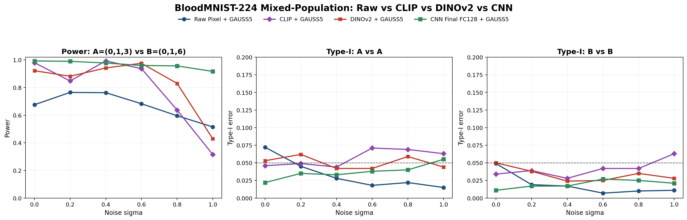
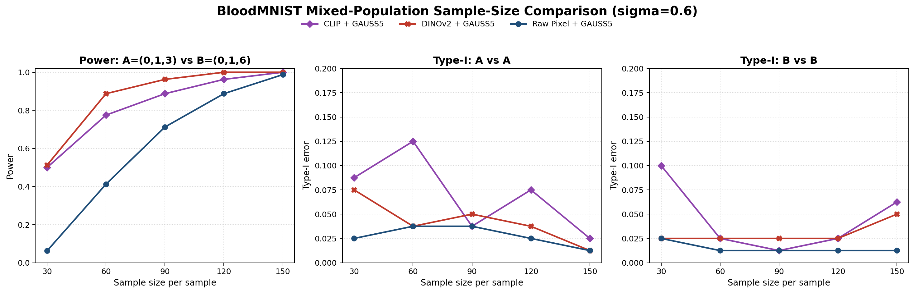
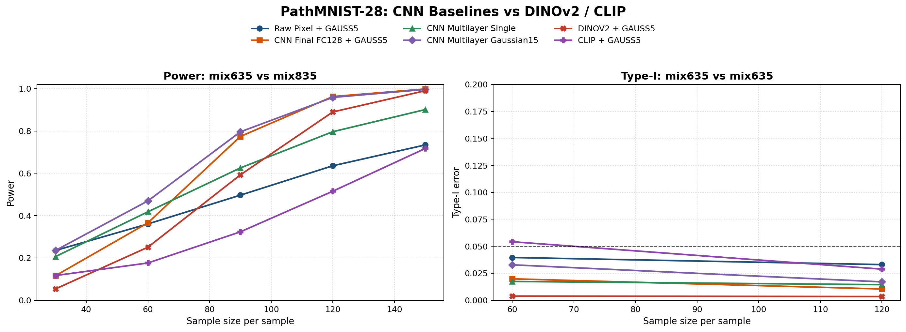
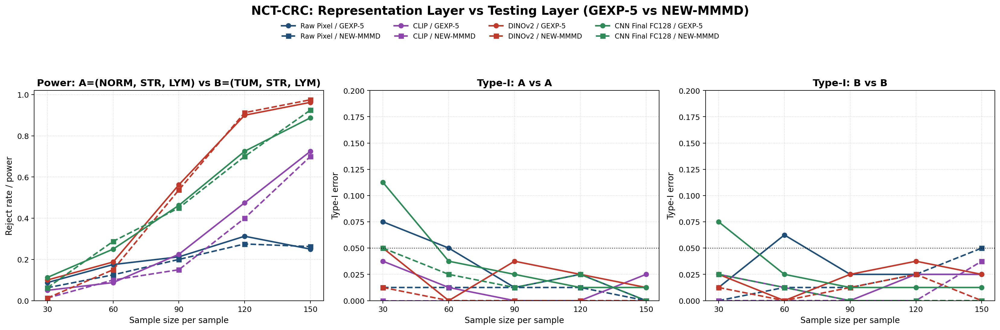

# Mahalanobis MMD for biomedical two-sample testing: review and representation experiments

Biostatistics final project report draft

Group members: [name 1, student ID], [name 2, student ID], [name 3, student ID], [name 4, student ID]

Contribution statement:

- [Worker 1]: [to be filled]
- [Worker 2]: [to be filled]
- [Worker 3]: [to be filled]
- Yao: representation-assisted MMMD experiments on BloodMNIST, PathMNIST, and NCT-CRC; CLIP, DINOv2, raw-pixel, CNN, and NEW-MMMD comparisons; experimental figures and result summaries.

## Abstract

Two-sample testing asks whether two independent samples come from the same distribution. This problem appears often in biostatistics because biological differences are rarely limited to a mean shift: two groups may differ in covariance, mixture proportion, morphology, sparsity, or tail behavior. The paper reviewed in this project studies Mahalanobis aggregated maximum mean discrepancy, which combines several kernel MMD statistics through an estimated covariance matrix instead of relying on a single bandwidth. Our report reviews the motivation and related literature for kernel two-sample tests, leaves dedicated sections for the original method, data review, and other group experiments, and then gives our own numerical study on image representations for MMMD. In the Yao component, we compare raw pixels, CLIP, DINOv2, and task-trained CNN features on BloodMNIST, PathMNIST, and NCT-CRC. The main empirical finding is that the power of MMMD depends strongly on the representation space. Raw pixels are usually sample inefficient; DINOv2 is stronger than CLIP on pathology-style images; a task-trained CNN is most robust on BloodMNIST; and NEW-MMMD improves calibration and covariance conditioning more consistently than it improves power.

## 1. Background, motivation, and related work

The two-sample problem tests whether two samples are drawn from the same distribution. Let \(P\) and \(Q\) be two probability distributions on a sample space \(\mathcal{X}\), and suppose we observe independent samples

$$
\mathcal{X}_m=\{X_1,\ldots,X_m\}\sim P,\qquad
\mathcal{Y}_n=\{Y_1,\ldots,Y_n\}\sim Q.
$$

The null and alternative hypotheses are

$$
H_0:P=Q,\qquad H_1:P\ne Q.
$$

This testing problem matters in biomedical applications because group differences can be multivariate and structured. In gene expression, microbiome profiles, single-cell measurements, and biomedical images, the difference between two populations may appear as a change in mixture composition, covariance, morphology, or a small subpopulation rather than a simple location shift. A useful method should therefore be nonparametric, valid under the null, and sensitive to alternatives that are hard to specify in advance.

Classical tests such as Wilcoxon/Mann-Whitney, Wald-Wolfowitz, and Kolmogorov-Smirnov are interpretable, but they are mainly designed for one-dimensional or ordered observations. Graph-based and distance-based methods extend two-sample testing to multivariate data. Examples include minimum-spanning-tree tests and energy-distance statistics. These methods can work well when the chosen distance captures the scientific difference, but distance geometry can become unreliable in high-dimensional or noisy settings, especially when nuisance variation dominates the signal.

Kernel two-sample tests based on maximum mean discrepancy, or MMD, give a flexible way to compare distributions. MMD compares the mean embeddings of \(P\) and \(Q\) in a reproducing kernel Hilbert space. With characteristic kernels, MMD is zero exactly when \(P=Q\) in the population. The practical difficulty is bandwidth choice. The median heuristic is easy to use, but finite-sample power can change sharply with the kernel and its scale. This is a serious issue in biomedical image tasks because the same biological difference may look small or large depending on whether the data are represented as raw pixels, CNN features, or pretrained foundation-model embeddings.

Recent work improves kernel two-sample testing in two main ways. One line learns or selects kernels to increase power, but selection can disturb Type-I error control if the same data are used for both tuning and testing. Data splitting avoids that problem but spends samples on selection. Another line aggregates multiple kernels, such as MMDAgg, to reduce dependence on a single bandwidth. Chatterjee and Bhattacharya's Mahalanobis MMD method follows the aggregation idea but uses the covariance structure among multiple MMD estimates. This is the part of the paper most relevant to our project: instead of asking which bandwidth is best, MMMD asks how to combine several correlated kernel discrepancies into one calibrated statistic.

Our own experiments add one question that is not fully answered by the original kernel-test setup: when the observations are images, how much of the two-sample power comes from the test itself, and how much comes from the representation? We therefore keep the testing layer fixed when possible and vary the representation. The comparison includes raw pixels, CLIP, DINOv2, and task-trained CNN features. This separation is useful because poor image geometry can make a good kernel test look weak, while a good embedding can make a biologically meaningful difference easier for MMMD to detect.

## 2. [To be completed] Proposed method in the reviewed paper

[This section is reserved for another worker.]

Suggested content:

- Explain the original paper's test statistic and how Mahalanobis aggregation combines multiple MMD estimates.
- Describe the covariance estimator, calibration procedure, and rejection rule.
- Compare the method with single-kernel MMD, MMDAgg, data-splitting kernel learning, and graph or distance tests.
- Discuss advantages and limitations, including bandwidth robustness, covariance estimation, computation, and possible small-sample instability.

## 3. [To be completed] Data and real application in the reviewed paper

[This section is reserved for another worker.]

Suggested content:

- Identify the real data application used in the paper, if any.
- State whether the original data are accessible.
- If the original data are not accessible, explain the alternative datasets used by the group.
- Clarify which results are reproduced from the paper and which are our own extensions.

## 4. [To be completed] Other numerical results from group members

[This section is reserved for another worker.]

Suggested content:

- Add simulations or reproductions outside the `yao` folder.
- Report the experimental protocol, parameter settings, baselines, and numerical results.
- Use separate tables for power and Type-I error.
- Make clear whether each result is a reproduction, a simplified pedagogical example, or a new extension.

## 5. Yao component: representation-assisted MMMD experiments

This section studies how image representation changes the behavior of MMMD-style two-sample tests. The main testing code is in `code/Biostatistics_fdu_26/yao/src/mmmd_functions.R`, with experiment scripts under `code/Biostatistics_fdu_26/yao/scripts`. The R implementation supports single Gaussian or Laplace MMD, five-kernel Gaussian or Laplace MMMD, and a mixed Gaussian-Laplace version. The experiments mostly use GAUSS5, so that changes in power can be attributed to the representation rather than to a changing test statistic.

### 5.1 Experimental design

The experiments use three biomedical image datasets. BloodMNIST-224 contains 17,092 blood-cell images and is used for noise robustness and sample-size studies. PathMNIST-28 contains 107,180 pathology patches and is used to compare frozen encoders with a task-trained CNN reproduction baseline. NCT-CRC contains 100,000 H&E image patches and is used for larger pathology-image sample-size experiments and for the NEW-MMMD testing-layer comparison.

The representation axis includes four choices. Raw pixels provide a direct image-space baseline. CLIP is a frozen image-language encoder. DINOv2 is a frozen self-supervised visual encoder. The CNN features are task-trained representations from the reproduction pipeline, especially the final FC-128 embedding. For each representation, embeddings are cached first, then the two-sample test is run repeatedly in R. This design avoids recomputing neural features during bootstrap testing and makes the statistical comparison easier to audit.

The main metrics are empirical power under a mixture alternative and empirical Type-I error under matched null settings. In the BloodMNIST mixed task, the alternative compares class-balanced mixtures \((0,1,3)\) and \((0,1,6)\), so the two populations share labels 0 and 1 and differ through labels 3 versus 6. In PathMNIST, the task follows the reproduction-aligned overlapping-mixture setting. In NCT-CRC, the alternative compares \((\mathrm{NORM}, \mathrm{STR}, \mathrm{LYM})\) with \((\mathrm{TUM}, \mathrm{STR}, \mathrm{LYM})\). These mixture tasks are more informative than single-class comparisons because they ask whether MMMD can detect a change in population composition rather than an easy class separation.

### 5.2 BloodMNIST-224: noise robustness

BloodMNIST shows that representation choice can dominate the test outcome. Under the mixed task \((0,1,3)\) versus \((0,1,6)\), raw pixels, CLIP, DINOv2, and CNN final features were compared across six Gaussian noise levels. The table below reports power at the two endpoints, \(\sigma=0\) and \(\sigma=1\), using the same GAUSS5 testing layer.

| Representation | Power at \(\sigma=0\) | Power at \(\sigma=1\) |
| --- | ---: | ---: |
| Raw pixels | 0.676 | 0.515 |
| CLIP | 0.980 | 0.315 |
| DINOv2 | 0.922 | 0.429 |
| CNN final FC-128 | 0.993 | 0.917 |

The task-trained CNN is the most robust representation in this setting. Its power stays above 0.91 even at \(\sigma=1\), while CLIP and DINOv2 drop more sharply under heavy additive noise. Raw pixels are weaker at low and moderate noise, although they do not collapse as much at the largest noise level. The matched-null Type-I error is close to nominal for the frozen encoders and generally conservative for raw pixels and CNN features, so the power differences are not explained by uncontrolled false positives.

The sample-size experiment at fixed \(\sigma=0.6\) gives a second view of the same phenomenon. DINOv2 and CLIP reach high power with fewer samples than raw pixels. At \(n=30\), DINOv2 and CLIP are already around 0.5 power, while raw pixels are close to 0.06. By \(n=120\), DINOv2 reaches 1.0 and CLIP reaches 0.9625, while raw pixels remain at 0.8875.

| Sample size | Raw pixels | CLIP | DINOv2 |
| ---: | ---: | ---: | ---: |
| 30 | 0.0625 | 0.5000 | 0.5125 |
| 60 | 0.4125 | 0.7750 | 0.8875 |
| 90 | 0.7125 | 0.8875 | 0.9625 |
| 120 | 0.8875 | 0.9625 | 1.0000 |
| 150 | 0.9875 | 1.0000 | 1.0000 |

### 5.3 PathMNIST-28: frozen encoders versus trained CNN baselines

PathMNIST gives a different lesson. In the reproduction-aligned overlapping-mixture setting, DINOv2 improves rapidly with sample size, but small samples still favor task-trained CNN baselines from the reproduction pipeline. CLIP is weaker than DINOv2 for medium and large sample sizes.

| Sample size | CLIP | DINOv2 |
| ---: | ---: | ---: |
| 30 | 0.1166 | 0.0534 |
| 60 | 0.1760 | 0.2506 |
| 90 | 0.3232 | 0.5926 |
| 120 | 0.5152 | 0.8900 |
| 150 | 0.7172 | 0.9904 |

The Type-I error results are controlled for both frozen encoders, but DINOv2 is very conservative in this experiment: its matched-null rejection rates are about 0.0038 at \(n=60\) and 0.0034 at \(n=120\). This means the high power at \(n=150\) is not due to an inflated null. It also suggests that the pretrained representation may need enough samples before the mixture difference becomes visible to MMMD. For very small \(28\times 28\) pathology patches, a small CNN trained on the target distribution can still be better matched to the task.

### 5.4 NCT-CRC: representation scaling on larger pathology images

The NCT-CRC experiment compares raw pixels, CLIP, CNN features, and DINOv2 on the mixture task \((\mathrm{NORM}, \mathrm{STR}, \mathrm{LYM})\) versus \((\mathrm{TUM}, \mathrm{STR}, \mathrm{LYM})\). Here the ranking changes with sample size. CNN features are competitive at small and medium \(n\), but DINOv2 becomes strongest once \(n\) is large enough.

| Sample size | Raw pixels | CLIP | CNN | DINOv2 |
| ---: | ---: | ---: | ---: | ---: |
| 30 | 0.125 | 0.013 | 0.100 | 0.038 |
| 60 | 0.113 | 0.063 | 0.288 | 0.188 |
| 90 | 0.175 | 0.200 | 0.575 | 0.475 |
| 120 | 0.238 | 0.500 | 0.738 | 0.875 |
| 150 | 0.300 | 0.750 | 0.875 | 0.988 |

This pattern fits the visual nature of NCT-CRC. DINOv2 features appear to capture tissue architecture that raw pixels and CLIP do not capture as efficiently. CLIP improves with sample size, but it remains weaker than DINOv2. Raw pixels are the least sample efficient across the sweep.

### 5.5 NEW-MMMD: stabilization and calibration

The last Yao experiment separates the representation layer from the testing layer. With NCT-CRC representations fixed, the original GEXP-5 style statistic is compared with NEW-MMMD, which stabilizes covariance estimation and prunes redundant kernels. On DINOv2 features, NEW-MMMD is more conservative at very small sample size, but it catches up by \(n=120\) and \(n=150\).

| Sample size | GEXP-5 power | NEW-MMMD power |
| ---: | ---: | ---: |
| 30 | 0.1000 | 0.0125 |
| 60 | 0.1875 | 0.1500 |
| 90 | 0.5625 | 0.5375 |
| 120 | 0.9000 | 0.9125 |
| 150 | 0.9625 | 0.9750 |

The clearest benefit of NEW-MMMD is numerical stability. In the DINOv2 NCT-CRC run, the raw covariance condition numbers for GEXP-5 are on the order of \(10^6\) to \(10^7\), while the regularized NEW-MMMD condition numbers are much smaller, often around \(10^4\) or below after pruning. Type-I error is also conservative in the matched-null settings. The tradeoff is power at small sample size: stabilization can reduce false positives and improve conditioning, but it does not automatically improve rejection power when \(n\) is small.

### 5.6 Summary of the Yao experiments

The representation space is not a preprocessing detail; it changes the statistical problem that MMMD sees. Raw pixels leave the kernel test to work directly in a high-dimensional noisy space. Frozen encoders often help, especially DINOv2 on pathology-style images, but they are not uniformly best. A task-trained CNN can be strongest when the dataset has enough labels to learn features aligned with the target morphology, as in BloodMNIST. NEW-MMMD improves calibration and matrix conditioning, but its power gains depend on sample size and representation.

These results suggest a practical guideline for biomedical two-sample testing with images. First, use a representation that reflects the biological scale of interest. Second, report Type-I error under matched nulls, because power alone can be misleading. Third, separate representation comparisons from test-statistic comparisons. If both are changed at once, it becomes unclear whether an improvement comes from better features, better aggregation, or a calibration artifact.

## 6. Limitations and future directions

The Yao experiments are informative but not exhaustive. Some sweeps use lighter Monte Carlo settings for compute control, especially the NCT-CRC and sample-size comparisons with \(n_{\mathrm{outer}}=4\), \(n_{\mathrm{inner}}=20\), and \(B_{\mathrm{boot}}=100\). These runs are useful for ranking representations, but final claims should be checked with larger repetitions if time allows. Another limitation is that CLIP and DINOv2 are frozen encoders trained outside the biomedical datasets. Their behavior may change with biomedical fine-tuning or with domain-specific foundation models.

Future work should test whether representation learning and MMMD can be tuned jointly while preserving Type-I error. One possible direction is to split data into representation selection and testing subsets, then compare the cost of splitting with the benefit of a better embedding. Another direction is to study which image features drive rejection, for example by comparing class-mixture changes, color perturbations, texture shifts, and morphology shifts separately. For practical biomedical use, interpretability matters: a significant two-sample test should ideally point to a visible or clinically meaningful distributional change instead of stopping at an abstract feature-space discrepancy.

## References

- Banerjee et al. (2019). Adaptive multivariate two-sample testing for microbiome differential abundance.
- Chatterjee and Bhattacharya (2025). Mahalanobis maximum mean discrepancy for boosting the power of kernel two-sample tests.
- Friedman and Rafsky (1979). Multivariate generalizations of the Wald-Wolfowitz and Smirnov two-sample tests.
- Gretton et al. (2012). A kernel two-sample test.
- Liu et al. (2020). Learning deep kernels for non-parametric two-sample tests.
- Ramdas et al. (2015). On the decreasing power of kernel and distance based nonparametric hypothesis tests in high dimensions.
- Schrab et al. (2023). MMD aggregated two-sample test.
- Yao experiment files under `code/Biostatistics_fdu_26/yao/results` and slide package `representation_final_package`.
